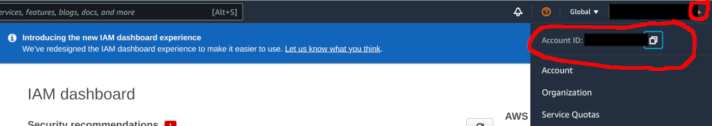

# Amazon DynamoDB Persistence

This service allows you to persist state updates using the [Amazon DynamoDB](https://aws.amazon.com/dynamodb/) database.
Query functionality is also fully supported.

Features:

* Writing/reading information to relational database systems
* Configurable database table names
* Automatic table creation

## Disclaimer

This service is provided "AS IS", and the user takes full responsibility of any charges or damage to Amazon data.

## Table of Contents

{::options toc_levels="2..4"/}
<!-- markdownlint-disable-next-line ul-style -->
- TOC

{:toc}

## Prerequisites

You must first set up an Amazon account as described below.

Users are recommended to familiarize themselves with AWS pricing before using this service.
Please note that there might be charges from Amazon when using this service to query/store data to DynamoDB.
See [Amazon DynamoDB pricing pages](https://aws.amazon.com/dynamodb/pricing/) for more details.
Please also note possible [Free Tier](https://aws.amazon.com/free/) benefits.

### Setting Up an Amazon Account

<!-- markdownlint-disable-next-line no-emphasis-as-heading -->
**Login to AWS web console**

* [Sign up](https://aws.amazon.com/) for Amazon AWS.
* Select the AWS region in the [AWS console](https://console.aws.amazon.com/) using [these instructions](https://docs.aws.amazon.com/awsconsolehelpdocs/latest/gsg/getting-started.html#select-region). Note the region identifier in the URL (e.g. `https://eu-west-1.console.aws.amazon.com/console/home?region=eu-west-1` means that region id is `eu-west-1`).

<!-- markdownlint-disable-next-line no-emphasis-as-heading -->
**Create policy controlling permissions for AWS user**

Here we create AWS IAM Policy to limit exposure to AWS resources.
This way, openHAB DynamoDB addon has limited access to AWS, even if credentials would be compromised.

**Note:** this policy is only valid for the new table schema.
New table schema is the default for fresh openHAB installations and for users that are taking DynamoDB into use for the first time.
For users with old table schema, one can use pre-existing policy `AmazonDynamoDBFullAccess` (although it gives wider-than-necessary permissions).

  1. Open Services menu, and search for _IAM_.
  2. From top right, press the small arrow on top right corner close to your name. Copy the _Account ID_ to clipboard by pressing the small "copy" icon
  
  3. In IAM dialog, select _Policies_ from the menu on the left
  4. Click _Create policy_
  5. Open _JSON_ tab and input the below policy code.
  6. Make the below the changes to the policy JSON `Resource` section

* Modify the AWS account id from `055251986555` to to the one you have on clipboard (see step 2 above)
* If you are on some other region than `eu-west-1`, change the entry accordingly


```json
{
    "Version": "2012-10-17",
    "Statement": [
        {
            "Sid": "VisualEditor0",
            "Effect": "Allow",
            "Action": [
                "dynamodb:BatchGetItem",
                "dynamodb:BatchWriteItem",
                "dynamodb:UpdateTimeToLive",
                "dynamodb:ConditionCheckItem",
                "dynamodb:PutItem",
                "dynamodb:DeleteItem",
                "dynamodb:Scan",
                "dynamodb:Query",
                "dynamodb:UpdateItem",
                "dynamodb:DescribeTimeToLive",
                "dynamodb:DeleteTable",
                "dynamodb:CreateTable",
                "dynamodb:DescribeTable",
                "dynamodb:GetItem",
                "dynamodb:UpdateTable"
            ],
            "Resource": [
                "arn:aws:dynamodb:eu-west-1:055251986555:table/openhab",
                "arn:aws:dynamodb:eu-west-1:055251986555:table/openhab/index/*"
            ]
        },
        {
            "Sid": "VisualEditor1",
            "Effect": "Allow",
            "Action": [
                "dynamodb:ListTables",
                "dynamodb:DescribeReservedCapacity",
                "dynamodb:DescribeLimits"
            ],
            "Resource": "*"
        }
    ]
}
```
<!-- markdownlint-disable ol-prefix -->
  4. Click _Next: Tags_
  5. Click _Next: Review_
  6. Enter `openhab-dynamodb-policy` as the _Name_
  7. Click _Create policy_ to finish policy creation
<!-- markdownlint-enable ol-prefix -->

<!-- markdownlint-disable-next-line no-emphasis-as-heading -->
**Create user for openHAB**

Here we create AWS user with programmatic access to the DynamoDB.
We associate the user with the policy created above.

  1. Open _Services_ -> _IAM_ -> _Users_ -> _Add users_. Enter `openhab` as _User name_, and tick _Programmatic access_
  2. Click _Next: Permissions_
  3. Select _Attach existing policies directly_, and search policies with `openhab-dynamodb-policy`. Tick the `openhab-dynamodb-policy` and proceed with _Next: Tags_
  4. Click _Next: review_
  5. Click _Create user_
  6. Record the _Access key ID_ and _Secret access key_

## Configuration

This service can be configured using the MainUI or using persistence configuration file `services/dynamodb.cfg`.

In order to configure the persistence service, you need to configure AWS credentials to access DynamoDB.

For new users, the other default settings are OK.

For DynamoDB persistence users with data stored with openHAB 3.1.0 or earlier, you need to decide whether you opt in to "new" more optimized table schema, or stay with "legacy".
See below for details.

### Table schema

The DynamoDB persistence addon provides two different table schemas: "new" and "legacy".
As the name implies, "legacy" is offered for backwards-compatibility purpose for old users who like to access the data that is already stored in DynamoDB.
All users are advised to transition to "new" table schema, which is more optimized.

At this moment there is no supported way to migrate data from old format to new.

#### New table schema

Configure the addon to use new schema by setting `table` parameter (name of the table).

Only one table will be created for all data. The table will have the following fields

| Attribute | Type   | Data type | Description                                   |
| --------- | ------ | --------- | --------------------------------------------- |
| `i`       | String | Yes       | Item name                                     |
| `t`       | Number | Yes       | Timestamp in milliepoch                       |
| `s`       | String | Yes       | State of the item, stored as DynamoDB string. |
| `n`       | Number | Yes       | State of the item, stored as DynamoDB number. |
| `exp`     | Number | Yes       | Expiry date for item, in epoch seconds        |

Other notes

<!-- markdownlint-disable ul-style -->
- `i` and `t` forms the composite primary key (partition key, sort key) for the table
- Only one of `s` or `n` attributes are specified, not both. Most items are converted to number type for most compact representation.
- Compared to legacy format, data overhead is minimizing by using short attribute names, number timestamps and having only single table.
- `exp` attribute is used with DynamoDB Time To Live (TTL) feature to automatically delete old data
<!-- markdownlint-enable ul-style -->

#### Legacy schema

Configure the addon to use legacy schema by setting `tablePrefix` parameter.

<!-- markdownlint-disable ul-style -->
- When an item is persisted via this service, a table is created (if necessary).
- The service will create at most two tables for different item types.
- The tables will be named `<tablePrefix><item-type>`, where the `<item-type>` is either `bigdecimal` (numeric items) or `string` (string and complex items).
- Each table will have three columns: `itemname` (item name), `timeutc` (in ISO 8601 format with millisecond accuracy), and `itemstate` (either a number or string representing item state).
<!-- markdownlint-enable ul-style -->

### Credentials Configuration Using Access Key and Secret Key

| Property  | Default | Required | Description                                                                                                                                                      |
| --------- | ------- | :------: | ---------------------------------------------------------------------------------------------------------------------------------------------------------------- |
| accessKey |         |   Yes    | access key as shown in [Setting up Amazon account](#setting-up-an-amazon-account).                                                                               |
| secretKey |         |   Yes    | secret key as shown in [Setting up Amazon account](#setting-up-an-amazon-account).                                                                               |
| region    |         |   Yes    | AWS region ID as described in [Setting up Amazon account](#setting-up-an-amazon-account). The region needs to match the region that was used to create the user. |

### Credentials Configuration Using Credentials File

Alternatively, instead of specifying `accessKey` and `secretKey`, one can configure a configuration profile file.

| Property           | Default | Required | Description                                                                                                                                                                                                                                                                                                                                    |
| ------------------ | ------- | :------: | ---------------------------------------------------------------------------------------------------------------------------------------------------------------------------------------------------------------------------------------------------------------------------------------------------------------------------------------------- |
| profilesConfigFile |         |   Yes    | path to the credentials file.  For example, `/etc/openhab2/aws_creds`. Please note that the user that runs openHAB must have approriate read rights to the credential file. For more details on the Amazon credential file format, see [Amazon documentation](https://docs.aws.amazon.com/cli/latest/userguide/cli-chap-getting-started.html). |
| profile            |         |   Yes    | name of the profile to use                                                                                                                                                                                                                                                                                                                     |
| region             |         |   Yes    | AWS region ID as described in Step 2 in [Setting up Amazon account](#setting-up-an-amazon-account). The region needs to match the region that was used to create the user.                                                                                                                                                                        |

Example of service configuration file (`services/dynamodb.cfg`):

```ini
profilesConfigFile=/etc/openhab2/aws_creds
profile=fooprofile
region=eu-west-1
```

Example of credentials file (`/etc/openhab2/aws_creds`):

````ini
[fooprofile]
aws_access_key_id=testAccessKey
aws_secret_access_key=testSecretKey
````

### Advanced Configuration

In addition to the configuration properties above, the following are also available:

| Property           | Default | Required | Description                                                 |
| ------------------ | ------- | :------: | ----------------------------------------------------------- |
| expireDays         | (null)  |    No    | Expire time for data in days (relative to stored timestamp) |
| readCapacityUnits  | 1       |    No    | read capacity for the created tables                        |
| writeCapacityUnits | 1       |    No    | write capacity for the created tables                       |

Refer to Amazon documentation on [provisioned throughput](https://docs.aws.amazon.com/amazondynamodb/latest/developerguide/HowItWorks.ProvisionedThroughput.html) for details on read/write capacity.
In case you have not reserved enough capacity for write and/or read, you will notice error messages in openHAB logs.
DynamoDB Time to Live (TTL) setting is configured using `expireDays`.

All item- and event-related configuration is done in the file `persistence/dynamodb.persist`.

## Details

### Caveats

When the tables are created, the read/write capacity is configured according to configuration.
However, the service does not modify the capacity of existing tables.
As a workaround, you can modify the read/write capacity of existing tables using the [Amazon console](https://aws.amazon.com/console/).

Similar caveat applies for DynamoDB Time to Live (TTL) setting `expireDays`.

## Developer Notes

### Updating Amazon SDK

1. Update SDK version and `netty-nio-client` version in `scripts/fetch_sdk_pom.xml`. You can use the [maven online repository browser](https://mvnrepository.com/artifact/software.amazon.awssdk/dynamodb-enhanced) to find the latest version available online.
2. `scripts/fetch_sdk.sh`
3. Copy printed dependencies to `pom.xml`. If necessary, adjust feature.xml, bnd.importpackage and dep.noembedding as well (probably rarely needed but [it happens](https://aws.amazon.com/blogs/developer/the-aws-sdk-for-java-2-17-removes-its-external-dependency-on-jackson/)).
4. Check & update `NOTICE` file with all the updated, new and removed dependencies.

After these changes, it's good practice to run integration tests (against live AWS DynamoDB) in `org.openhab.persistence.dynamodb.test` bundle.
See README.md in the test bundle for more information how to execute the tests.

### Running integration tests

When running integration tests, local temporary DynamoDB server is used, emulating the real AWS DynamoDB API.
One can configure AWS credentials to run the test against real AWS DynamoDB for most realistic tests.

Eclipse instructions

1. Run all tests (in package org.openhab.persistence.dynamodb.internal) as JUnit Tests
2. Configure the run configuration, and open Arguments sheet
3. In VM arguments, provide the credentials for AWS

```bash
-DDYNAMODBTEST_REGION=REGION-ID
-DDYNAMODBTEST_ACCESS=ACCESS-KEY
-DDYNAMODBTEST_SECRET=SECRET

--add-opens=java.base/java.lang=ALL-UNNAMED
```

The `--add-opens` parameter is necessary also with the local temporary DynamoDB server, otherwise the mockito will fail at runtime with (`java.base does not "opens java.lang" to unnamed module`).

