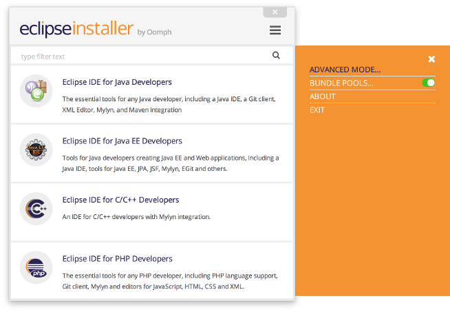
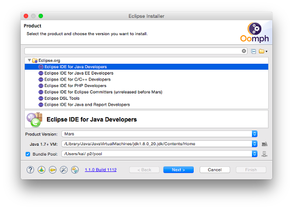

# Setting up an IDE for openHAB 2

If you are a developer yourself, you might want to setup a development environment, so that you can debug and develop openHAB 2 yourself.

Note that the project build is completely mavenized - so running "mvn install" on the repository root will nicely build the product. For development and debugging, we recommend using an Eclipse IDE though. It should be possible to use other IDEs (e.g. NetBeans or IntelliJ), but you will have to work out how to resolve OSGi dependencies etc. yourself. So unless you have a strong reason to go for another IDE, we recommend using Eclipse.

## Prerequisites

Make sure that you have the following things installed on your computer:

Please ensure that you have the following prerequisites installed on your machine:

1. [Git](https://git-scm.com/downloads)
1. [Maven 3.x](https://maven.apache.org/download.cgi) (optional, Eclipse m2e can also be used)
1. [Oracle JDK 7 or 8](http://www.oracle.com/technetwork/java/javase/downloads/jdk8-downloads-2133151.html)

_Note:_ You can find a screencast of the setup process here:

The Eclipse IDE is used for openHAB developments. The Eclipse Installer automatically prepares the IDE so that it comes with all required plug-ins, the correct workspace encoding settings, pre-configured code formatters and more. Simply follow these steps:

1. Download the [Eclipse Installer](https://wiki.eclipse.org/Eclipse_Installer)
2. Launch the Eclipse Installer and switch to "Advanced Mode" in the top right menu:

3. Choose the "Eclipse IDE for Java Developers" and select "Next":

4. Expand the "Github.com/openHAB" entry, double click "openHAB 2 Development" and select "Next".
5. Now provide an installation folder (don't use spaces in the path on Windows!) and your Github id (used to push your changesets to) and select "Next".
6. The installation will now begin when pressing "Finish".
7. Once it is done, you will see the Eclipse Welcome Screen, which you can close by clicking "Workbench" on the top right. You will see that the installer not only set up an Eclipse IDE instance for you, but also checked out the openHAB 2 git repository and imported all projects into the workspace. 
8. Your workspace should now fully compile and you can start the runtime by launching the "openHAB Runtime" launch configuration.

Note that you will find the sources in a subfolder called "git" within your selected installation folder. You can use any kind of git client here, if you do not want to use the git support from within the Eclipse IDE.
If you want to push changes, you need to do so to [your personal fork of the openHAB 2 repository](https://github.com/openhab/openhab2/fork) in order to create a pull request. You will find more details in the ["How to contribute"](../../../CONTRIBUTING.md) documentation.

### Maven build for binary packages

To produce a binary zip of the runtime yourself, you can simply call `mvn clean package` from the repository root and you will find the result in the folder distribution/target. Alternatively, you may use the run configuration "BuildDistribution" which uses Eclipse m2e to run the maven build inside the Eclipse console (after the first successful run, you can enable 'Offline' option which speeds up the build considerably).

To run a single test you have to use following command: `mvn -o org.eclipse.tycho:tycho-surefire-plugin:0.20.0:test` which activates the tycho-surefire-specific goal for OSGI unit test using the fragment bundle xxxx.test on xxxx bundle. The maven -o (offline) option accelerates the project dependency resolution by 10-20x since it lets maven search its local repository. Normally, snapshot-enabled projects are using external repositories to find latest built packages.
