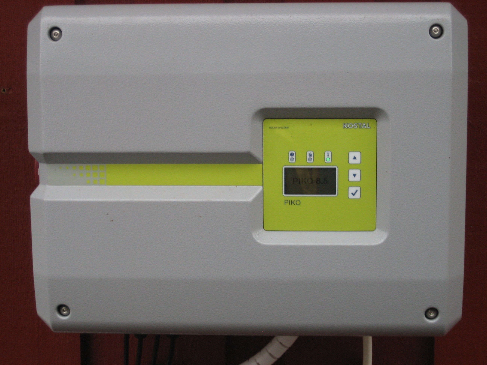

# Kostal Inverter Binding Piko New Generation with Configuration Possibilities

Scrapes the Web interface of the inverter for the metrics of the supported channels below. With opportunities to change selected channels.



## Supported Things

Tested with Kostal Inverter New Generation .


## Discovery

None

## Channels                     Units of Mesurement         Type

```
-   gridOutputPower             Number:Power                WATT
-   yield_Day                   Number:Power                WATT
-   yield_Total                 Number:Energy               KILOWATT_HOUR
-   operatingStatus             String
-   gridVoltageL1               Number:ElectricPotential    VOLT
-   gridCurrentL1               Number:ElectricCurrent      AMPERE
-   gridPowerL1                 Number:Power                WATT
-   gridVoltageL2               Number:ElectricPotential    VOLT
-   gridCurrentL2               Number:ElectricCurrent      AMPERE
-   gridPowerL2                 Number:Power                WATT
-   gridVoltageL3               Number:ElectricPotential    VOLT
-   gridCurrentL3               Number:ElectricCurrent      AMPERE
-   gridPowerL3                 Number:Power                WATT
-   dcPowerPV                   Number:Power                WATT
-   dc1Voltage                  Number:ElectricPotential    VOLT
-   dc1Current                  Number:ElectricCurrent      AMPERE
-   dc1Power                    Number:Power                WATT
-   dc2Voltage                  Number:ElectricPotential    VOLT
-   dc2Current                  Number:ElectricCurrent      AMPERE
-   dc2Power                    Number:Power                WATT
-   dc3Voltage                  Number:ElectricPotential    VOLT
-   dc3Current                  Number:ElectricCurrent      AMPERE
-   dc3Power                    Number:Power                WATT

-   aktHomeConsumptionSolar     Number:Power                WATT
-   aktHomeConsumptionBat       Number:Power                WATT
-   aktHomeConsumptionGrid      Number:Power                KILOWATT_HOUR
-   phaseSelHomeConsumpL1       Number:Power                WATT
-   phaseSelHomeConsumpL2       Number:Power                WATT
-   phaseSelHomeConsumpL3       Number:Power                WATT
-   gridFreq                    Number:Frequency            HERTZ
-   gridCosPhi                  Number:Angle                DEGREE_ANGLE
-   homeConsumption_Day         Number:Energy               KILOWATT_HOUR
-   ownConsumption_Day          Number:Energy               KILOWATT_HOUR
-   ownConsRate_Day             Number:Dimensionless        PERCENT
-   autonomyDegree_Day          Number:Dimensionless        PERCENT
-   homeConsumption_Total       Number:Energy               KILOWATT_HOUR
-   ownConsumption_Total        Number:Energy               KILOWATT_HOUR
-   totalOperatingTime          Number:Time                 HOUR
-   current                     Number:ElectricCurrent      AMPERE
-   currentDir                  Number:ElectricCurrent      AMPERE
-   chargeCycles                String 
-   batteryTemperature          Number:Temperature          CELCIUS
-   loginterval                 Number:Time                 MINUTE
-   s0InPulseCnt                String
-   ownConsRate_Total           Number:Dimensionless        PERCENT
-   autonomyDegree_Total        Number:Dimensionless        PERCENT
-   batteryVoltage              Number:ElectricPotential    VOLT
-   batStateOfCharge            Dimensionless               PERCENT


## The following Channels are changeable        Units of Mesurement Options
-  batteryType                      String          Battery type, Value = 1 = None, Value = 2 = PIKO Battery Li, Value = 3 = BYD B-Box HV
-  batteryUsageConsumption          String          Value = 100
-  batteryUsageStrategy             String          Value = 1 = Automatic, Value = 2 = Automatic economical             
-  smartBatteryControl              Switch          Value = False / True
-  smartBatteryControl_Text         String          Value = False / True
-  batterChargeTimeFrom             Number:Time     Battery charge time, Value = 00:00
-  batteryChargeTimeTo              Number:Time     Battery charge time, Value = 23:59
-  maxDepthOfDischarge              String          Max.depth of discharge (SoC), Value = 10
-  shadowManagement                 Number          Shadow management, Value = 0 = None, Value = 1 = Shadow management + String 1 activated, Value = 2 = Shadow  management + String 2 activated, Value = 3 = Shadow management + String 1 and 2 activated
-  externalModuleControl            String          External module control, Value = 0 = True
-  inverterName                     String          Value = 'Name of inverter'

```

## Thing Configuration

demo.things

```
kostalinverterpikonewgeneration:kostalinverterpikonewgeneration:inverter [ url="http://'inverter-ip'", username="'username'", password="'password'", refreshInterval=60]

```

If the thing goes online then the connection to the Web interface is successful. In case
it is offline you should see an error message.

## Items

demo.items:

```
Number:Power SolarPower                 "AC Power [%.2f %unit%]"                    <energy> (gGF) { channel="kostalinverterpikonewgeneration:kostalinverterpikonewgeneration:inverter:gridOutputPower" }
Number SolarPower_Max                   "Todays Maximum [%.2f %unit%]"              <energy> (gGF) 
Number SolarPower_Min                   "Todays Mimimum [%.2f %unit%]"              <energy> (gGF) 
Number SolarPowerChart                  "Chart Period Solar Power"
DateTime SolarPowerTimestamp            "Last Update AC Power [%1$ta %1$tR]"        <clock>

Number:Power SolarEnergyDay             "Day Energy [%.2f %unit%]"                  <energy> (gGF) { channel="kostalinverterpikonewgeneration:kostalinverterpikonewgeneration:inverter:yield_Day" }
Number SolarEnergyDay_Max               "Todays Maximum [%.2f %unit%]"              <energy> (gGF) 
Number SolarEnergyDay_Min               "Todays Mimimum [%.2f %unit%]"              <energy> (gGF) 
Number SolarEnergyDayChart              "Chart Period SolarEnergyDay "
DateTime SolarEnergyDayTimestamp        "Last Update Day Energy  [%1$ta %1$tR]"     <clock>

Number:Energy SolarTotalEnergy          "Total Energy [%.2f %unit%]"                <energy> (gGF) { channel="kostalinverterpikonewgeneration:kostalinverterpikonewgeneration:inverter:yield_Total" }
Number SolarTotalEnergy_Max             "Todays Maximum [%.2f %unit%]"              <energy> (gGF) 
Number SolarTotalEnergy_Min             "Todays Mimimum [%.2f %unit%]"              <energy> (gGF) 
Number SolarTotalEnergyChart            "Chart Period SolarTotalEnergy "
DateTime SolarTotalEnergyTimestamp      "Last Update Total Energy  [%1$ta %1$tR]"   <clock>

String SolarStatus                      "Status[%s]"                                <energy> (gGF) { channel="kostalinverterpikonewgeneration:kostalinverterpikonewgeneration:inverter:operatingStatus" }
Number SolarStatus_Max                  "Todays Maximum [%s]"                       <energy> (gGF) 
Number SolarStatus_Min                  "Todays Mimimum [%s]"                       <energy> (gGF) 
Number SolarStatusChart                 "Chart Period SolarStatus "
DateTime SolarStatusTimestamp           "Last Update Solar Status  [%1$ta %1$tR]"   <clock>

Number:ElectricPotential        GridVoltageL1       "L1 Voltage[%.2f %unit%]"       <energy> (gGF) { channel="kostalinverterpikonewgeneration:kostalinverterpikonewgeneration:inverter:gridVoltageL1" }
Number:ElectricCurrent          GridCurrentL1       "L1 Current[%.2f %unit%]"       <energy> (gGF) { channel="kostalinverterpikonewgeneration:kostalinverterpikonewgeneration:inverter:gridCurrentL1" }
Number:Power                    GridPowerL1         "L1 Power[%.2f %unit%]"         <energy> (gGF) { channel="kostalinverterpikonewgeneration:kostalinverterpikonewgeneration:inverter:gridPowerL1" }
Number:ElectricPotential        GridVoltageL2       "L2 Voltage[%.2f %unit%]"       <energy> (gGF) { channel="kostalinverterpikonewgeneration:kostalinverterpikonewgeneration:inverter:gridVoltageL2" }
Number:ElectricCurrent          GridCurrentL2       "L2 Current[%.2f %unit%]"       <energy> (gGF) { channel="kostalinverterpikonewgeneration:kostalinverterpikonewgeneration:inverter:gridCurrentL2" }
Number:Power                    GridPowerL2         "L2 Power[%.2f %unit%]"         <energy> (gGF) { channel="kostalinverterpikonewgeneration:kostalinverterpikonewgeneration:inverter:gridPowerL2" }
Number:ElectricPotential        GridVoltageL3       "L3 Voltage[%.2f %unit%]"       <energy> (gGF) { channel="kostalinverterpikonewgeneration:kostalinverterpikonewgeneration:inverter:gridVoltageL3" }
Number:ElectricCurrent          GridCurrentL3       "L3 Current[%.2f %unit%]"       <energy> (gGF) { channel="kostalinverterpikonewgeneration:kostalinverterpikonewgeneration:inverter:gridCurrentL3" }
Number:Power                    GridPowerL3         "L3 Power[%.2f %unit%]"         <energy> (gGF) { channel="kostalinverterpikonewgeneration:kostalinverterpikonewgeneration:inverter:gridPowerL3" }
Number:Power                    DcPvPower           "PV Power[%.2f %unit%]"         <energy> (gGF) { channel="kostalinverterpikonewgeneration:kostalinverterpikonewgeneration:inverter:dcPowerPV" }
Number:ElectricPotential        DC1Voltage          "DC1 Voltage[%.2f %unit%]"      <energy> (gGF) { channel="kostalinverterpikonewgeneration:kostalinverterpikonewgeneration:inverter:dc1Voltage" }
Number:ElectricCurrent          DC1Current          "DC1 Current[%.2f %unit%]"      <energy> (gGF) { channel="kostalinverterpikonewgeneration:kostalinverterpikonewgeneration:inverter:dc1Current" }
Number:Power                    DC1Power            "DC1 Power[%.2f %unit%]"        <energy> (gGF) { channel="kostalinverterpikonewgeneration:kostalinverterpikonewgeneration:inverter:dc1Power" }
Number:ElectricPotential        DC2Voltage          "DC2 Voltage[%.2f %unit%]"      <energy> (gGF) { channel="kostalinverterpikonewgeneration:kostalinverterpikonewgeneration:inverter:dc2Voltage" }
Number:ElectricCurrent          DC2Current          "DC2 Current[%.2f %unit%]"      <energy> (gGF) { channel="kostalinverterpikonewgeneration:kostalinverterpikonewgeneration:inverter:dc2Current" }
Number:Power                    DC2Power            "DC2 Power[%.2f %unit%]"        <energy> (gGF) { channel="kostalinverterpikonewgeneration:kostalinverterpikonewgeneration:inverter:dc2Power" }
Number:ElectricPotential        DC3Voltage          "DC3 Voltage[%.2f %unit%]"      <energy> (gGF) { channel="kostalinverterpikonewgeneration:kostalinverterpikonewgeneration:inverter:dc3Voltage" }
Number:ElectricCurrent          Dc3Current          "DC3 Current[%.2f %unit%]"      <energy> (gGF) { channel="kostalinverterpikonewgeneration:kostalinverterpikonewgeneration:inverter:dc3Current" }
Number:Power                    DC3Power            "DC3 Power[%.2f %unit%]"        <energy> (gGF) { channel="kostalinverterpikonewgeneration:kostalinverterpikonewgeneration:inverter:dc3Power" }

Number:Power                    AktHomeConsumptionSolar "Home Consumption Solar[%.2f %unit%]"   <energy>  { channel="kostalinverterpikonewgeneration:kostalinverterpikonewgeneration:inverter:aktHomeConsumptionSolar" }
Number:Power                    AktHomeConsumptionBat   "Home Consumption Battery[%.2f %unit%]" <energy>  { channel="kostalinverterpikonewgeneration:kostalinverterpikonewgeneration:inverter:aktHomeConsumptionBat" }
Number:Power                    AktHomeConsumptionGrid  "Home Consumption Grid[%.2f %unit%]"    <energy>  { channel="kostalinverterpikonewgeneration:kostalinverterpikonewgeneration:inverter:aktHomeConsumptionGrid" }
Number:Power                    PhaseSelHomeConsumpL1   "Home Consumption L1[%.2f %unit%]"      <energy>  { channel="kostalinverterpikonewgeneration:kostalinverterpikonewgeneration:inverter:phaseSelHomeConsumpL1" }
Number:Power                    PhaseSelHomeConsumpL2   "Home Consumption L2[%.2f %unit%]"      <energy>  { channel="kostalinverterpikonewgeneration:kostalinverterpikonewgeneration:inverter:phaseSelHomeConsumpL2" }
Number:Power                    PhaseSelHomeConsumpL3   "Home Consumption L3[%.2f %unit%]"      <energy>  { channel="kostalinverterpikonewgeneration:kostalinverterpikonewgeneration:inverter:phaseSelHomeConsumpL3" }
Number:Frequency                GridFreq                "Grid Frequency[%.2f %unit%]"           <energy>  { channel="kostalinverterpikonewgeneration:kostalinverterpikonewgeneration:inverter:gridFreq" }
Number:Angle                    GridCosPhi              "Grid Phase Shift[%.2f %unit%]"         <energy>  { channel="kostalinverterpikonewgeneration:kostalinverterpikonewgeneration:inverter:gridCosPhi" }
Number:Energy                   HomeConsumption_Day     "Home Consumption Daily[%.2f %unit%]"   <energy>  { channel="kostalinverterpikonewgeneration:kostalinverterpikonewgeneration:inverter:homeConsumption_Day" }
Number:Energy                   OwnConsumption_Day      "Own Consumption Daily[%.2f %unit%]"    <energy>  { channel="kostalinverterpikonewgeneration:kostalinverterpikonewgeneration:inverter:ownConsumption_Day" }
Number:Dimensionless            OwnConsRate             "Own Cons Rate Daily[%.2f %unit%]"      <energy>  { channel="kostalinverterpikonewgeneration:kostalinverterpikonewgeneration:inverter:ownConsRate_Day" }
Number:Dimensionless            AutonomyDegree          "Autonomy Degree Daily[%.2f %unit%]"    <energy>  { channel="kostalinverterpikonewgeneration:kostalinverterpikonewgeneration:inverter:autonomyDegree_day" }
Number:Energy                   HomeConsumption_Total   "Home Consumption Total[%.2f %unit%]"   <energy>  { channel="kostalinverterpikonewgeneration:kostalinverterpikonewgeneration:inverter:homeConsumption_Total" }
Number:Energy                   OwnConsumption_Total    "Own Consumption Total[%.2f %unit%]"    <energy>  { channel="kostalinverterpikonewgeneration:kostalinverterpikonewgeneration:inverter:ownConsumption_Total" }
Number:Time                     OperatingTime           "Operating Time Total[%.2f %unit%]"     <energy>  { channel="kostalinverterpikonewgeneration:kostalinverterpikonewgeneration:inverter:totalOperatingTime" }
Number:ElectricCurrent          Current                 "Current[%.2f %unit%]"                  <energy>  { channel="kostalinverterpikonewgeneration:kostalinverterpikonewgeneration:inverter:current" }
Number:ElectricCurrent          CurrentDir              "Current Dir[%.2f %unit%]"              <energy>  { channel="kostalinverterpikonewgeneration:kostalinverterpikonewgeneration:inverter:currentDir" }
String                          ChargeCycles            "Charge Cycles[%s]"                     <energy>  { channel="kostalinverterpikonewgeneration:kostalinverterpikonewgeneration:inverter:chargeCycles" }
Number:Temperature              Temperature             "Temperature[%.2f %unit%]"              <energy>  { channel="kostalinverterpikonewgeneration:kostalinverterpikonewgeneration:inverter:batteryTemperature" }
Number:Time                     Loginterval             "Log Interval[%.2f %unit%]"             <energy>  { channel="kostalinverterpikonewgeneration:kostalinverterpikonewgeneration:inverter:loginterval" }
String                          S0InPulseCnt            "S0 In Pulse Counter[%s]"               <energy>  { channel="kostalinverterpikonewgeneration:kostalinverterpikonewgeneration:inverter:s0InPulseCnt" }
Number:Dimensionless            OwnConsRate_Total       "Own Cons Rate Total[%.2f %unit%]"      <energy>  { channel="kostalinverterpikonewgeneration:kostalinverterpikonewgeneration:inverter:ownConsRate_Total" }
Number:Dimensionless            AutonomyDegree_Total    "Autonomy Degree Total[%.2f %unit%]"    <energy>  { channel="kostalinverterpikonewgeneration:kostalinverterpikonewgeneration:inverter:autonomyDegree_Total" }

Number:Dimensionless            ChargeLevelBattery      "Charge Level Battery[%.2f %unit%]"     <energy>  { channel="kostalinverterpikonewgeneration:kostalinverterpikonewgeneration:inverter:chargeLevelBattery" }
Number:Dimensionless            GridLimitation          "Grid Limitation[%.2f %unit%]"          <energy>  { channel="kostalinverterpikonewgeneration:kostalinverterpikonewgeneration:inverter:gridLimitation" }
Number:ElectricPotential        BatteryVoltage          "Battery Voltage[%.2f %unit%]"          <energy>  { channel="kostalinverterpikonewgeneration:kostalinverterpikonewgeneration:inverter:batteryVoltage" }
Number:Dimensionless            BatStateOfCharge        "Bat State Of Charge[%.2f %unit%]"      <energy>  { channel="kostalinverterpikonewgeneration:kostalinverterpikonewgeneration:inverter:batStateOfCharge" }

String                          BatteryType             "Battery Type[%s]"                      <energy>  { channel="kostalinverterpikonewgeneration:kostalinverterpikonewgeneration:inverter:batteryType" }
String                          BatteryUsageConsumption "Battery Usage Consumption[%s]"         <energy>  { channel="kostalinverterpikonewgeneration:kostalinverterpikonewgeneration:inverter:batteryUsageConsumption" }
String                          BatteryUsageStrategy    "Battery Usage Strategy[%s]"            <energy>  { channel="kostalinverterpikonewgeneration:kostalinverterpikonewgeneration:inverter:batteryUsageStrategy" }
Switch                          SmartBatteryControl     "Smart Battery Control[%s]"             <energy>  { channel="kostalinverterpikonewgeneration:kostalinverterpikonewgeneration:inverter:smartBatteryControl" }
String                          SmartBatteryControl_Text"Smart Battery Control_Text[%s]"        <energy>  { channel="kostalinverterpikonewgeneration:kostalinverterpikonewgeneration:inverter:smartBatteryControl_Text" }
Number:Time                     BatteryChargeTimeFrom   "Battery Charge Time From[%.2f %unit%]" <energy>  { channel="kostalinverterpikonewgeneration:kostalinverterpikonewgeneration:inverter:batteryChargeTimeFrom" }
Number:Time                     BatteryChargeTimeTo     "Battery Charge Time To[%.2f %unit%]"   <energy>  { channel="kostalinverterpikonewgeneration:kostalinverterpikonewgeneration:inverter:batteryChargeTimeTo" }
String                          MaxDephtOfDischarge     "Max Depht Of Discharge[%s]"            <energy>  { channel="kostalinverterpikonewgeneration:kostalinverterpikonewgeneration:inverter:maxDephtOfDischarge" }
String                          ShadowManagement        "Shadow Management[%s]"                 <energy>  { channel="kostalinverterpikonewgeneration:kostalinverterpikonewgeneration:inverter:shadowManagement" }
String                          ExternalModuleControl   "External Module Control[%s]"           <energy>  { channel="kostalinverterpikonewgeneration:kostalinverterpikonewgeneration:inverter:externalModuleControl" }
String                          InverterName            "InverterName[%s]"                      <energy>  { channel="kostalinverterpikonewgeneration:kostalinverterpikonewgeneration:inverter:inverterName" }

```